# UTS PEMROGRAMAN MOBILE 

A new Flutter project.

## Getting Started

This project is a starting point for a Flutter application.

<li><b>Nama  : Riris Silvia Zahri
<li><b>Kelas : MI 2A
<li><b>NIM   : 1931710085

# Hasil Bentuk Video

 

# Main Menu
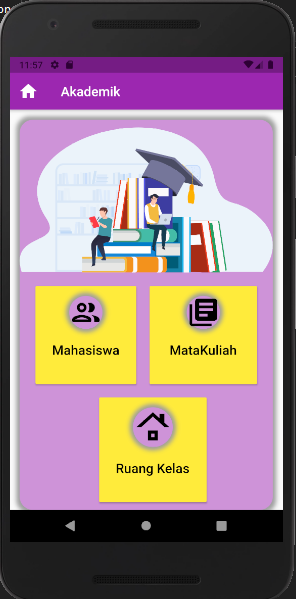

# Halaman MataKulaih
## Tambah Data Pada tabel matakuliah
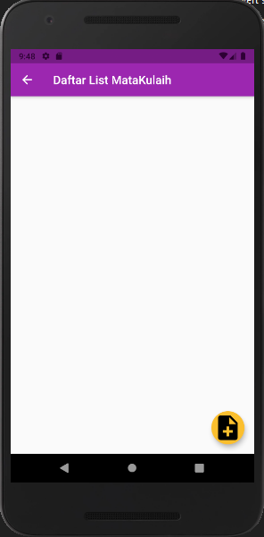
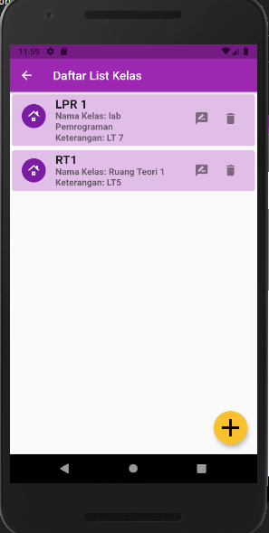
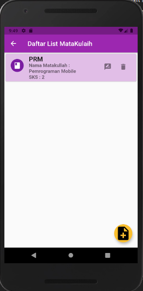

## Edit Data Pada tabel matakuliah
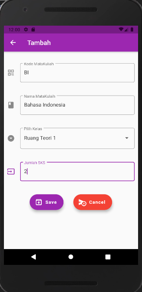
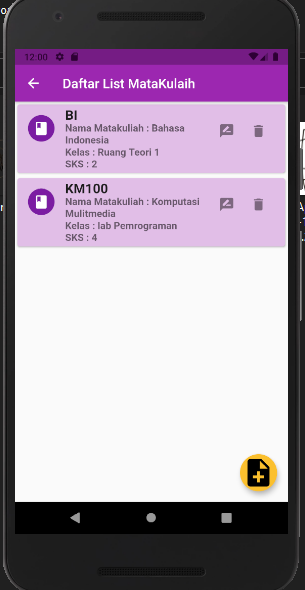

# Halaman Mahasiswa
## Tambah Data Pada tabel Mahasiswa
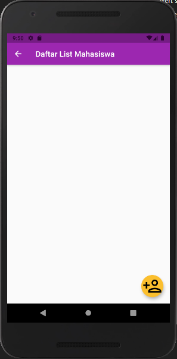
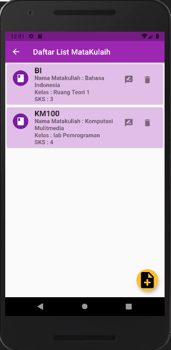
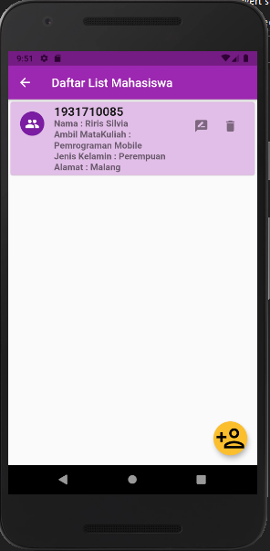

## Edit Data Pada tabel Mahasiswa
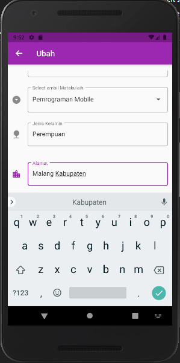
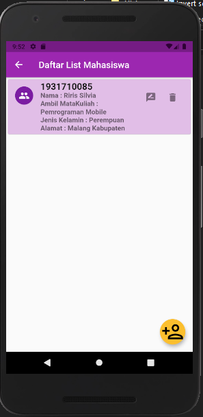

# Delete Data Pada tabel yang berelasi
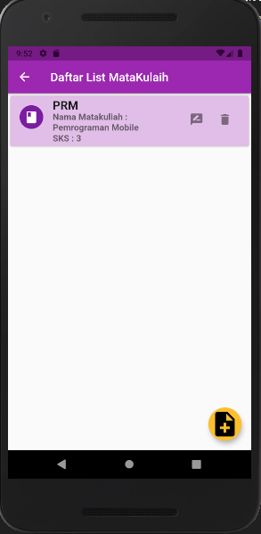

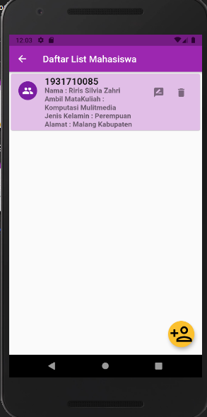
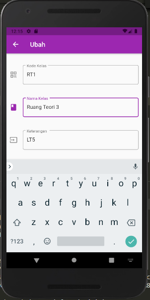

