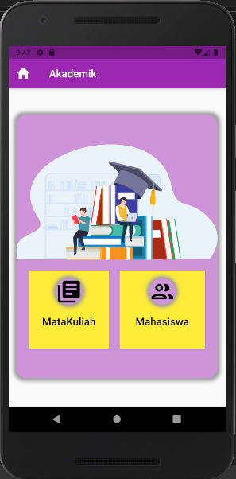
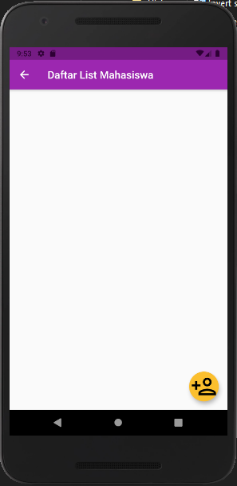
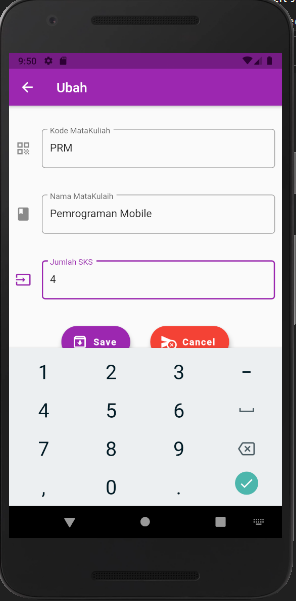
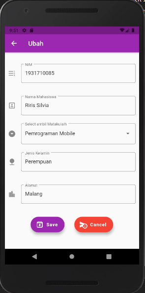

# UTS PEMROGRAMAN MOBILE 

A new Flutter project.

## Getting Started

This project is a starting point for a Flutter application.

A few resources to get you started if this is your first Flutter project:

- [Lab: Write your first Flutter app](https://flutter.dev/docs/get-started/codelab)
- [Cookbook: Useful Flutter samples](https://flutter.dev/docs/cookbook)

For help getting started with Flutter, view our
[online documentation](https://flutter.dev/docs), which offers tutorials,
samples, guidance on mobile development, and a full API reference.

<li><b>Nama  : Riris Silvia Zahri
<li><b>Kelas : MI 2A
<li><b>NIM   : 1931710085

# Hasil Bentuk Video

 

# Main Menu

# Halaman Kelas
## Tambah Data Pada tabel Kelas

## Edit Data Pada tabel Kelas

## Delete Data Pada item tabel Kelas

# Halaman MataKulaih
## Tambah Data Pada tabel matakuliah

## Edit Data Pada tabel matakuliah

## Delete Data Pada item tabel matakulaih

# Halaman Mahasiswa
## Tambah Data Pada tabel Mahasiswa

## Edit Data Pada tabel Mahasiswa

## Delete Data Pada item tabel Mahasiswa

